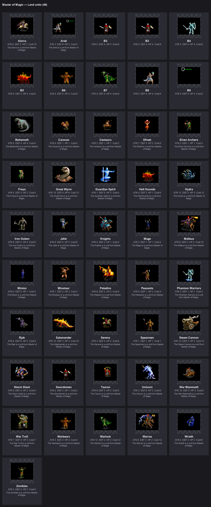
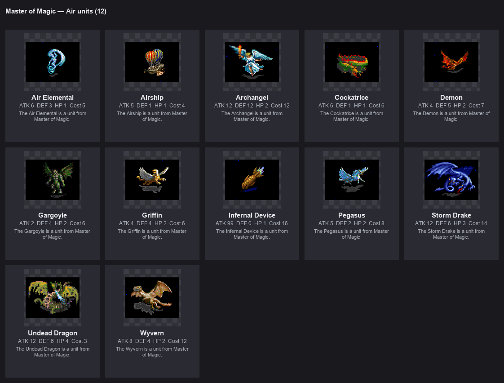
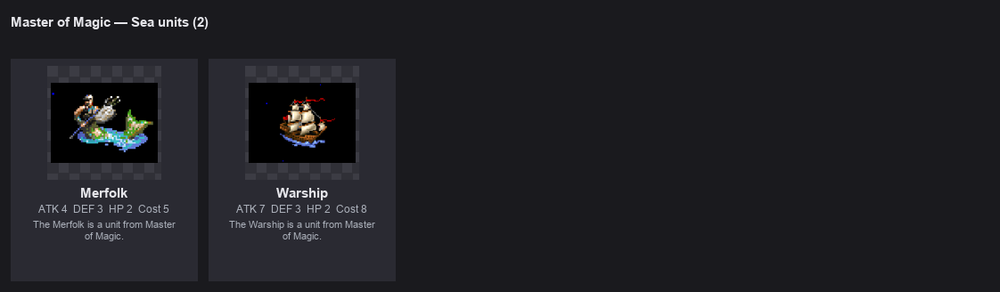

# Faction Overview

Masters of Magic has five sphere-aligned factions plus a neutral pool of shared
units. Each faction has a distinct identity, unit roster, and strategic personality.

## The Five Factions

| Faction | Sphere | Player | Theme | Units |
|---------|--------|--------|-------|-------|
| Holy Order | Life | 1 | Protection, healing, angels | 10 |
| Fey Court | Nature | 2 | Growth, creatures, primal force | 15 |
| Arcane Enclave | Sorcery | 3 | Knowledge, illusion, control | 11 |
| Necropolis | Death | 4 | Undead, drain, inevitability | 13 |
| Underworld | Chaos | 5 | Fire, destruction, demons | 13 |

Neutral units (Dwarves, Knights, Settlers, siege) are available to all factions
based on advance prerequisites.

## Roster Design

Each faction's roster is **tiered by advance prerequisite**:

- **Early game** (rung 1-2): Cheap troops, light creatures
- **Mid game** (rung 3-4): Elite infantry, powerful creatures
- **Late game** (rung 5-6): Ultimate creatures, heroes

Higher-tier units require deeper sphere research. A Nature wizard at rung 1
has Warbears and Centaurs. At rung 5 they can field Great Wyrms and Behemoths.

## Unit Stat Format

Throughout the faction pages, unit stats are shown as:

- **a** = Attack strength
- **d** = Defense strength
- **h** = Hit points per figure
- **f** = Firepower (damage multiplier)
- **Move** = Tiles per turn (domain: Land/Air/Sea)

## Heroes

Each sphere has 1-2 named heroes. Heroes are:

- **CantBuild** — never appear in city build queues
- **Summon-only** — acquired through spellbook summon spells
- **Ladder-gated** — unlocked at specific sphere advance rungs
- **Not unique** — you CAN summon the same hero twice (mana cost is the scarcity)

See [Heroes](heroes.md) for the complete hero roster and rules.

## Sprite Sheets

All unit sprites are extracted from HoMM2 art and converted to CTP2's TGA format:

