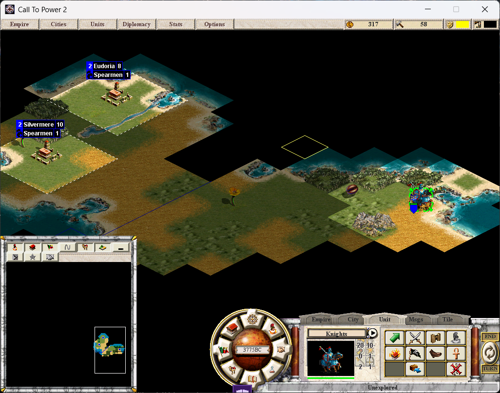

# Your First Game

## Choosing a Faction

When you start a new game, you'll play as one of five wizard factions. Each
faction corresponds to a sphere of magic:

| Faction | Sphere | Playstyle |
|---------|--------|-----------|
| Holy Order | Life | Defensive, healing, protection |
| Fey Court | Nature | Creatures, growth, raw power |
| Arcane Enclave | Sorcery | Control, illusion, knowledge |
| Necropolis | Death | Undead, drain, inevitability |
| Underworld | Chaos | Fire, destruction, high burst |

For your first game, **Life** or **Nature** are the most forgiving. Life gives
you strong defenses and healing. Nature gives you powerful creatures early.

## Early Game (Turns 1-20)

### Build Order

1. **Settler** first if you want to expand quickly
2. **Barracks** to unlock veteran troops
3. **Temple** for happiness
4. **Spearmen/Swordsmen** for defense

### Research Priority

Start with your sphere's entry advance:
- Life → Life Magic → Life Lore → Life Adept
- Nature → Nature Magic → Nature Lore → Nature Adept
- Sorcery → Sorcery → Sorcerous Lore → Sorcery Adept
- Death → Death Magic → Death Lore → Death Adept
- Chaos → Chaos Magic → Chaos Lore → Chaos Adept

Each rung on your sphere ladder unlocks stronger creatures and spells.

### Mana Pool

Your magic pool fills each turn based on:
- Base generation (fixed per turn)
- City population (more citizens = more power)
- Mana nodes (gold/gems tiles in your city radius)
- School multiplier (set when you research your sphere's entry advance)

Spend mana to summon creatures or cast spells. Don't hoard it past your max.

## Mid Game (Turns 20-60)

By now you should have:
- 2-3 cities producing troops
- Your sphere ladder at rung 2-3
- A hero summoned from your spellbook
- War Mage or Arch Mage for proximity casting

### Key Concepts

- **Proximity casting**: Your mages must be within range of the target city to
  cast offensive spells. Position them carefully.
- **Army composition**: Mix unit types for morale bonuses. Same-sphere armies
  get fellowship bonuses.
- **Spell hand**: You draw spells each turn. Larger hand = more options per turn.

## Late Game (Turns 60+)

Push toward your sphere's Master advance. When researched, the **Cataclysm**
triggers: terrain around your cities transforms into your sphere's element.
This gives your units home-field advantage and signals to opponents that you're
approaching victory.

The ultimate win condition: research and cast the **Spell of Mastery** (arcane,
costs 5000 mana, 60000 research). The caster wins immediately.

## Tips

- Heroes are summon-only. They never appear in city build queues.
- Losing a hero hurts but isn't permanent. Resummon them (it costs mana).
- Scout with fast units (Centaurs, Air Elementals) before committing armies.
- Watch for opposing-sphere units near your borders. They resist your magic.
- The Lamp artifact grants +15% spell resistance to its holder's army.

