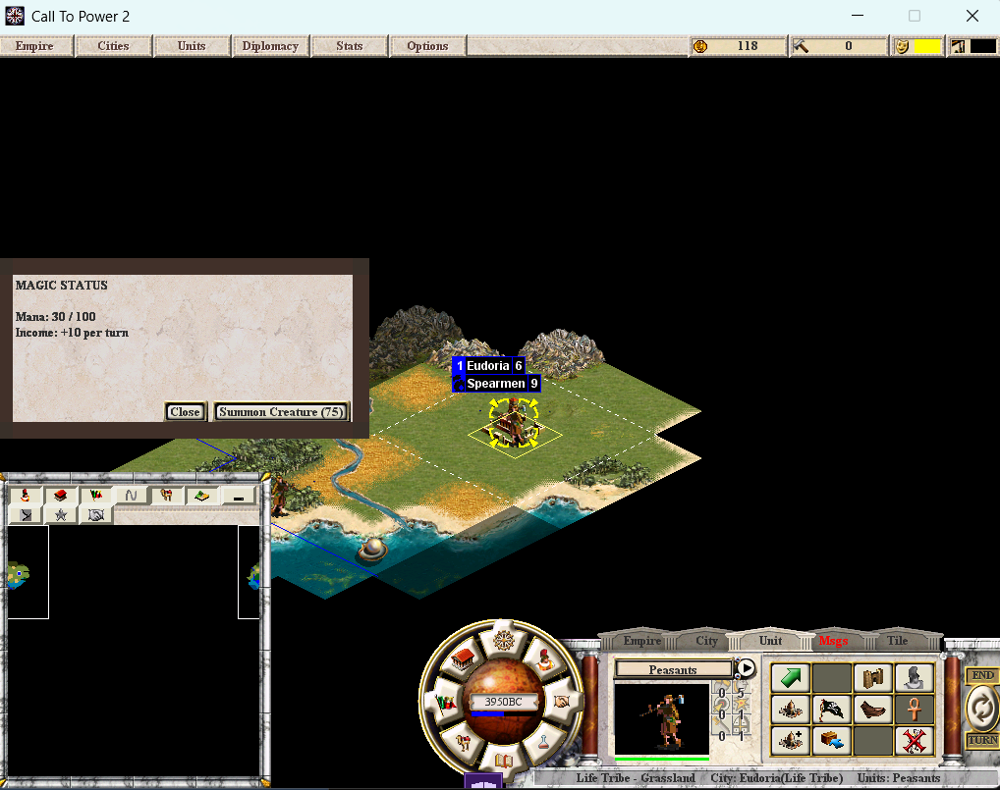

# Magic System Overview

Magic in Masters of Magic is **spatial, resource-constrained, and unit-bound**.
It draws from MtG's color wheel, Mage Knight's hand economy, and HoMM's
hero-driven casting.

## Core Principles

1. **Magic is spatial.** Your mages must be physically positioned within range of
   the target. You can't cast across the map from your capital.
2. **Units ARE spells.** Each elite creature has a signature ability. Lose that
   unit, lose access to that spell's full effect.
3. **Resistance is graduated.** No total blocks. Every spell has a chance to land;
   sphere affinities shift the odds.
4. **Spells are drawn.** You don't have your entire spellbook every turn. Draw a
   hand, play what you get.
5. **The land transforms.** Master your sphere and the terrain reshapes in your
   image.

## How Magic Flows

```
Research → Spellbook → Hand Draw → Cast (mana cost) → Effect
                                     ↑
                            Requires: mage in range
                            Requires: bound unit (for signatures)
```

### The Mana Pool

Each player has three magic numbers:

- **MomMagicCur** — current power available to spend
- **MomMagicMax** — maximum pool capacity (set by sphere school)
- **MomMagicPerTurn** — power gained each turn

Per-turn generation is calculated from:
- Base rate (fixed)
- Population coefficient (more citizens = more power)
- Mana nodes (gold/gems tiles in city radius)
- School multiplier (sphere-specific, set on advance grant)

| School | Multiplier | Max Pool |
|--------|-----------|----------|
| Life | 100% | 200 |
| Nature | 110% | 220 |
| Death | 115% | 240 |
| Sorcery | 125% | 260 |
| Chaos | 140% | 300 |

Chaos generates the most raw power. Sorcery has the best capacity-to-cost ratio.
Life is balanced baseline.

### The Spellbook

All spells your sphere has access to live in your spellbook. But you can't cast
directly from the book — you draw from it into your **hand** each turn.

### The Hand

Each turn you draw N spells into your hand (N depends on your sphere rung and
Arcana stat). You can only cast what's in your hand this turn. Uncast spells
persist between turns, but hand size is capped.

### Casting

To cast a spell:
1. It must be in your hand
2. You must have enough mana (MomMagicCur >= spell cost)
3. For offensive spells: a mage unit must be within range of the target
4. For signature spells: the specific bound unit must be present and in range

## The Five Subsystems

| System | Page | What It Covers |
|--------|------|---------------|
| Spellbook & Casting | [Spellbook](spellbook.md) | How spells enter your pool and how casting resolves |
| Spell Hand | [Draw Economy](spell-hand.md) | Hand size, draw rate, deck management |
| Proximity & Targeting | [Targeting](targeting.md) | Range model, mage positioning |
| Resistance & Affinities | [Resistance](resistance.md) | Graduated resistance, sphere opposition |
| Unit-Spell Bindings | [Bindings](bindings.md) | Signature spells tied to specific units |
| Enchant Stacking | [Stacking](stacking.md) | Cumulative enchantment layers |
| Cataclysm | [Cataclysm](cataclysm.md) | Endgame terrain transformation |


