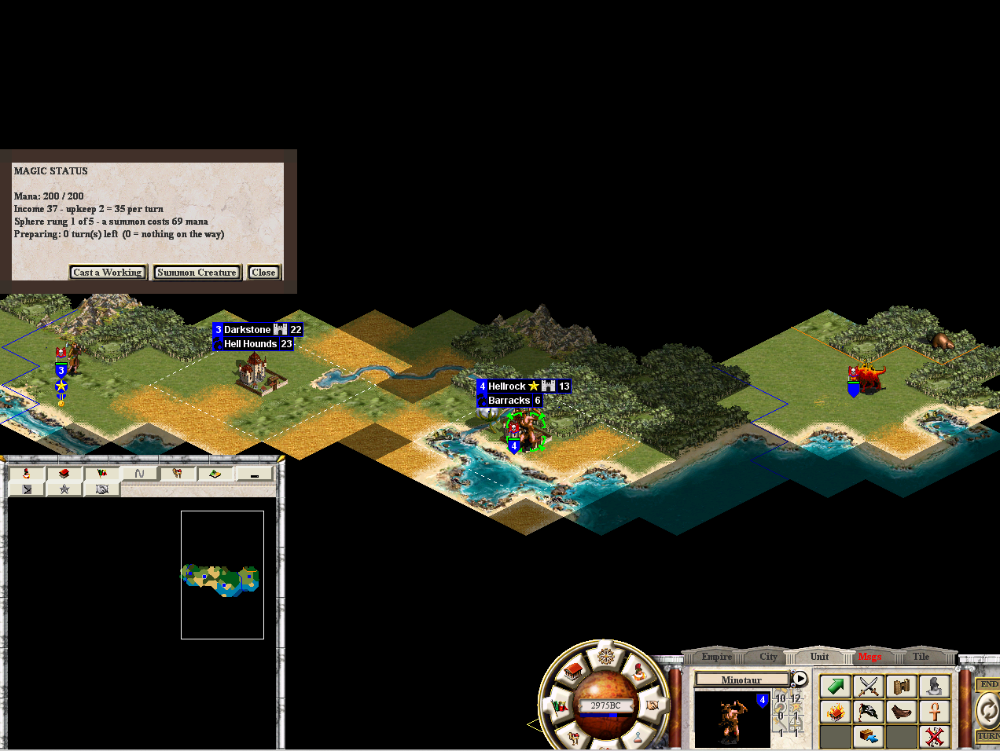

# Spellbook & Casting

## Your Spellbook

Your spellbook contains every spell your sphere has unlocked through research.
Spells are organized by:

- **Sphere** (Life, Nature, Sorcery, Death, Chaos, Arcane)
- **Rarity** (Common, Uncommon, Rare, Very Rare)
- **Type** (Summoning, Unit Enchantment, Town Enchantment, Global Enchantment,
  Combat Instant, Instant Spell, Unit Curse)

Arcane spells are available to all spheres. They include utility magic like
Dispel Magic, Summon Hero, and the win-condition Spell of Mastery.

## Spell Types

| Type | When Cast | Duration | Example |
|------|-----------|----------|---------|
| Summoning Spell | Overland | Permanent unit | Summon Hero, War Bears |
| Unit Enchantment | Overland or combat | Until dispelled | Bless, Holy Armor |
| Town Enchantment | Overland | Until dispelled | Heavenly Light, Wall of Fire |
| Global Enchantment | Overland | Until dispelled | Crusade, Armageddon |
| Combat Instant | Combat only | Immediate | Healing, Fire Bolt |
| Instant Spell | Overland | Immediate | Earthquake, Black Wind |
| Unit Curse | Combat | Until dispelled | Confusion, Weakness |

## Casting Costs

Each spell has two cost fields:

- **Overland Cost** — mana spent to cast from the overland map
- **Combat Cost** — mana spent to cast during combat

Some spells have both (can be cast in either context). Some are combat-only
(overland cost = 0) or overland-only (combat cost = 0).

## Cast Sequence

```
1. Player selects spell from hand
2. System checks: MomMagicCur >= cost?
   - No → "Insufficient mana" message, nothing happens
3. System checks: required unit present and in range?
   - No → Fallback effect (reduced/generic), mana still deducted
   - Yes → Full signature effect
4. MomMagicCur -= cost
5. Effect resolves (summon, damage, enchant, etc.)
```

## Research Costs

Spells must be researched before they enter your spellbook. Research cost scales
with rarity:

| Rarity | Typical Research Cost |
|--------|---------------------|
| Common | 20 - 250 |
| Uncommon | 300 - 800 |
| Rare | 880 - 1,700 |
| Very Rare | 1,850 - 6,000 |

The Spell of Mastery costs 60,000 research — a deliberate long game commitment.

## AI Casting

AI wizards use the same mana pool and spell system. On each BeginTurn, the AI:
1. Checks if it has enough power for its threshold
2. Picks a valid enemy target via city scanning
3. Casts one spell if affordable
4. Never acts for human players, never crashes on missing targets


