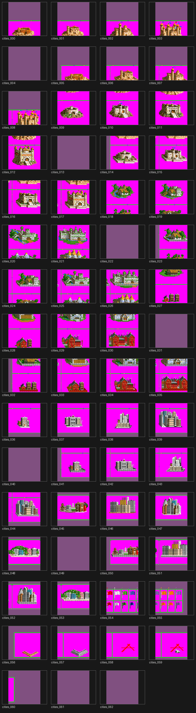

# Building List

City improvements and wonders generated from `improvements.csv`.

## Building Icons (Observer Sheet)

## City Art

## Data Table

| Building | Sphere | Cost | Upkeep | Prereq | Effects |
|----------|--------|------|--------|--------|---------|
| Aqueduct | Neutral | 8 | 2 | Cst | RaiseOvercrowdingLevel 6; RaiseMaxPopulation 14 |
| Bardic College | Neutral | 20 | 0 | Tra |  |
| Barracks | Neutral | 4 | 1 | — | EnablesLandVeterans; DefendersPercent 10 |
| Cathedral | Neutral | 12 | 3 | MT | HappyInc 3; IsReligious; Cathedral |
| City Walls | Neutral | 8 | 0 | Mas | DefendersPercent 15; PreventConversion 0.5; PreventSlavery 0... |
| Coastal Fortress | Neutral | 8 | 1 | — | CoastalBuilding; OffenseBonusWater 25; DefendersPercent 10 |
| Colosseum | Neutral | 10 | 4 | Cst | HappyInc 2 |
| Courthouse | Neutral | 8 | 1 | CoL | LowerCrime -0.1 |
| Gnome Treasury | Neutral | 40 | 0 | Eco |  |
| Granary | Neutral | 6 | 1 | Pot | FoodPercent 0.1; StarvationProtection 2 |
| Great Library | Neutral | 30 | 0 | Lit |  |
| Guild of Legends | Neutral | 30 | 0 | Feu |  |
| Gunthar's Voyage | Neutral | 40 | 0 | Nav |  |
| Harbor | Neutral | 6 | 1 | Sea | CoastalBuilding; FoodPercent 0.1 |
| Library | Neutral | 8 | 1 | Wri | SciencePercent 0.1 |
| Mechanician's Guild | Neutral | 20 | 4 | X3 | ProductionPercent 0.15; AllowGrunts |
| Merchant's Guild | Neutral | 16 | 4 | Eco | CommercePercent 0.15; Brokerage |
| Mesmer's Tower | Neutral | 30 | 0 | Cmb |  |
| Mystic X's Tower | Neutral | 30 | 0 | Ast |  |
| Oracle | Neutral | 30 | 0 | Mys |  |
| Port | Neutral | 8 | 3 | U3 | CoastalBuilding; CommercePercent 0.1 |
| Prospero's Conservatory | Neutral | 30 | 0 | CA |  |
| Reywind's Discovery | Neutral | 40 | 0 | RR |  |
| Rune of Rulership | Neutral | 30 | 0 | E1 |  |
| Temple | Neutral | 4 | 1 | Cer | HappyInc 1; IsReligious; Cathedral |
| The Parthenon | Neutral | 40 | 0 | MT |  |
| University | Neutral | 16 | 3 | Uni | SciencePercent 0.15 |
| Wizard's Fortress | Neutral | 10 | 0 | Mas | Capitol; HappyInc 1; DefendersPercent 25 |
| Celestial Beacon | Life | 60 | 0 | Too |  |
| Enchanted Grotto | Life | 40 | 0 | Inv |  |
| Fantastic Stable | Nature | 16 | 3 | X4 | OffenseBonusLand 25; IncreaseHP 5 |
| Font of Bounty | Nature | 20 | 0 | Plu |  |
| Gaia's Shrine | Nature | 20 | 0 | PT |  |
| Primal Source | Nature | 16 | 2 | U1 | FoodPercent 0.15; HappyInc 1 |
| Beacon of Wisdom | Sorcery | 16 | 3 | Fli | SciencePercent 0.2 |
| Eldritch College | Sorcery | 40 | 0 | Ato |  |
| League of Wizards | Sorcery | 60 | 0 | Phy |  |
| Pleasure Dome | Sorcery | 20 | 0 | The |  |
| Entropy Engine | Death | 60 | 0 | Sth |  |
| Wall of Bone | Death | 30 | 0 | Rob |  |
| Elixir of Metamorphosis | Chaos | 40 | 0 | Cmp |  |
| Forge of Chaos | Chaos | 60 | 0 | Min |  |

**Total: 42 buildings**
