# LotR Art Catalog

458 unit icons from the CTP2 Lord of the Rings mod.

Use this to pick replacements for MoM units that need better art.

Tell me: "Use LotR **XXX** for **UNIT_NAME**"

| Icon | ID | Description |
|------|----|-------------|
| 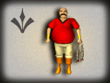 | 100C | A bald man in a red shirt holding fish. |
| 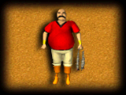 | 100 | A bald man in a red shirt holding fish. |
| 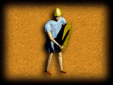 | 101 | A soldier in blue tunic holding a yellow shield. |
|  | 102C | A soldier in armor holding a polearm. |
| 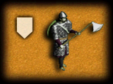 | 102 | A medieval soldier in chainmail armor holding a polearm weapon. |
| 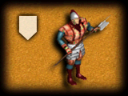 | 103C | A soldier in red and blue armor holding a spear. |
| 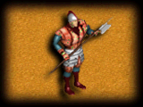 | 103 | A soldier in red and blue armor holding a spear. |
| 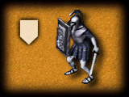 | 104C | An armored warrior holding a shield and sword. |
| 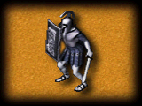 | 104 | Roman soldier wearing helmet holding shield and sword |
| 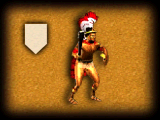 | 105C | Warrior with red feathered helmet holding a spear |
| 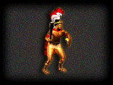 | 105g | Warrior with red feathered helmet holding a spear |
| 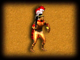 | 105 | Warrior with red feathered helmet holding a spear |
| 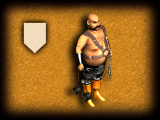 | 106C | A large, bald warrior with a beard wearing a harness holding a chain. |
| 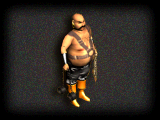 | 106g | A large, bald warrior with a beard wearing a harness holding a chain. |
| 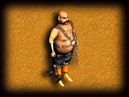 | 106 | A large, bald warrior with a beard wearing a harness holding a chain. |
| 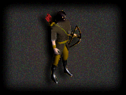 | 107g | An archer in green and yellow holding a bow with a quiver on his back. |
| 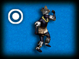 | 108C | A warrior character in armor and a crown stands beside a target icon. |
| 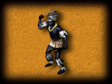 | 108 | A warrior character in armor and a crown poses with a raised fist. |
| 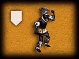 | 108_1C | A warrior character in armor and a crown stands beside a shield icon. |
| 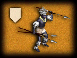 | 109C | A warrior character in armor and a crown holds multiple spears. |
| 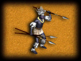 | 109 | Crowned armored warrior holding multiple spears |
| 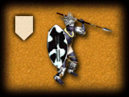 | 110C | Warrior with shield and spear standing |
| 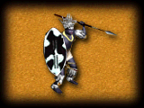 | 110 | Warrior with shield and spear standing |
| 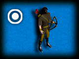 | 111C | Archer with bow and quiver |
| 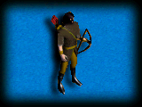 | 111 | A pixelated archer character holding a bow |
| 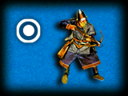 | 112C | An archer in armor aiming a bow |
| 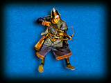 | 112 | An archer character in medieval clothing holding a bow |
| 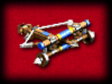 | 113 | A mechanical crossbow device with blue components |
| 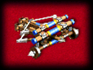 | 114 | A wooden cart with blue barrels and wheels |
| 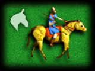 | 115C | A knight in blue armor riding a yellow horse |
| 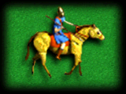 | 115 | A knight in blue armor riding a yellow horse |
| 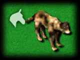 | 116C | A brown wolf standing on green grass |
| 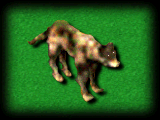 | 116 | A brown dog standing on green background |
| 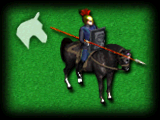 | 117C | A knight riding a black horse with a spear |
| 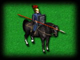 | 117 | A knight riding a black horse facing forward |
| 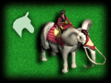 | 118C | A person riding a grey elephant with a saddle |
| 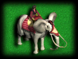 | 118 | Elephant carrying a rider in red clothing |
| 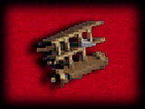 | 119 | Wooden siege tower structure on wheels |
|  | 120 | Wooden cart with a ballista weapon |
| 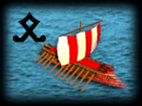 | 121C | Ship with red and white striped sail |
| 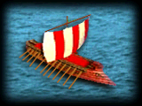 | 121 | A wooden ship with red and white striped sails. |
| 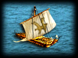 | 122 | A wooden ship with a sail featuring a golden bird. |
| 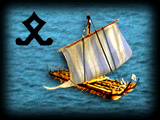 | 123C | A wooden ship with a sail and a black symbol. |
| 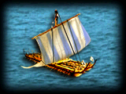 | 123 | A wooden ship with blue and white striped sails. |
| 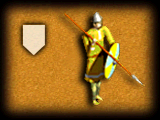 | 125C | A pixelated soldier holding a spear and shield. |
| 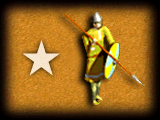 | 125E | A pixelated soldier holding a spear and shield. |
| 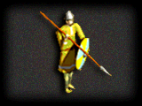 | 125g | A pixelated soldier holding a spear and shield. |
| 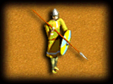 | 125 | A pixelated soldier holding a spear and shield. |
| 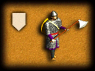 | 126C | Armored soldier holding a polearm weapon on tan background |
| 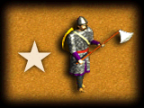 | 126E | Armored soldier holding a polearm weapon on tan background |
| 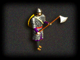 | 126g | Armored soldier holding a polearm weapon on dark background |
|  | 126g | Armored soldier holding a polearm weapon on dark background |
| 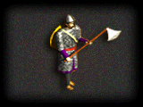 | 126H | Pixelated medieval soldier holding a polearm weapon |
|  | 126 | Armored warrior holding a polearm weapon |
|  | 126 | Armored warrior holding a polearm weapon |
|  | 126U | Armored figure holding a polearm weapon |
|  | 127C | A soldier holding a spear and wearing armor. |
|  | 127E | A warrior holding a spear and wearing armor. |
|  | 127 | A warrior standing with a spear and armor. |
|  | 128C | A soldier holding a sword and shield. |
|  | 128E | A Roman soldier holding a sword and shield next to a star |
|  | 128g | A Roman soldier standing in a dark environment |
|  | 128 | A Roman soldier holding a sword and shield next to a star |
|  | 128 | A Roman soldier holding a sword and shield next to a star |
|  | 129 | Roman soldier, blonde hair, yellow tunic, holding shield and sword. |
|  | 130C | Roman soldier, red plumed helmet, holding spear and shield. |
|  | 130 | Roman soldier, red plumed helmet, holding spear and shield. |
|  | 131C | Roman soldier, silver armor, striped skirt, holding sword and blue shield. |
|  | 131E | A Roman soldier standing with a sword and blue shield. |
|  | 131 | A Roman soldier walking forward holding a sword and shield. |
|  | 132C | A Roman soldier wearing red armor and holding a red shield. |
|  | 132E | A Roman soldier in red armor standing next to a star. |
|  | 132 | A Roman soldier standing with sword and shield |
|  | 133C | A knight riding a horse holding a bow |
|  | 133 | A knight riding a horse holding a bow |
|  | 134C | A knight in gold armor riding a horse |
|  | 134 | Soldier riding a horse with a spear. |
|  | 134 | Soldier riding a horse with a spear. |
|  | 135C | Knight riding a horse with a sword. |
|  | 135 | Knight riding a horse with a sword. |
|  | 136C | Knight on horseback holding a sword and shield |
|  | 136 | Knight riding a horse with a blue shield |
|  | 136 | Knight riding a horse with a blue shield |
|  | 137C | Archer standing with bow and arrows |
|  | 137g | A fantasy archer character with red pants and a bow. |
|  | 137 | A fantasy archer character with red pants and a bow. |
|  | 138C | A fantasy archer character with yellow pants and green tunic. |
|  | 138 | A fantasy archer character with yellow pants and green tunic. |
|  | 139C | A standing archer in armor holding a bow. |
|  | 139 | An archer standing against a blue background. |
|  | 139 | An archer standing against a blue background. |
|  | 140H | A knight riding a horse with a spear. |
|  | 140 | A person riding a horse with a bow |
|  | 140U | A mounted warrior holding a spear |
|  | 141 | A sailing ship with a cross flag |
|  | 142C | A ship with two sails and a symbol |
|  | 142 | A wooden ship with two sails and oars |
|  | 143 | A wooden ship with a dragon head prow and sail |
|  | 144 | A golden armored figure with large orange wings |
|  | 144U | A golden armored figure with large orange wings |
|  | 145H | Hooded figure riding a black horse |
|  | 145 | Archer riding a black horse holding a bow |
|  | 145U | Warrior on horseback holding a spear |
|  | 146 | Horse-headed humanoid holding a staff |
|  | 147 | A wooden cart with a thatched roof pulled by a horse |
|  | 147U | A wooden cart with a thatched roof pulled by a horse |
|  | 148 | A green ninja character in a full-body suit |
|  | 149 | An armored warrior holding a curved sword |
|  | 149U | Samurai warrior in armor holding a curved sword |
|  | 150 | Skeletal dragon with wings spread out |
|  | 150U | Skeletal dragon with wings spread out |
|  | 151H | Warrior in black armor holding a mace |
|  | 151 | Samurai warrior in armor holding a curved polearm |
|  | 151U | Samurai warrior in armor holding a curved polearm |
|  | 152C | Hooded robed figure holding a golden staff |
|  | 152H | Hooded robed figure holding a golden staff |
|  | 152 | A hooded mage in robes holding a staff |
|  | 152U | A hooded mage holding a staff on purple background |
|  | 153 | A golden spider-like creature |
|  | 153U | A golden spider on a purple background |
|  | 154 | Biomechanical scythe weapon with tentacles |
|  | 154U | Biomechanical scythe weapon with tentacles |
|  | 155C | Roman soldier holding sword and shield |
|  | 155GG | Roman soldier holding sword and shield |
|  | 155H | Roman soldier holding sword and shield |
|  | 155 | Roman soldier standing with sword and shield |
|  | 155 | Roman soldier standing with sword and shield |
|  | 156 | Man in white tunic with red sash holding scroll |
|  | 157 | Armored knight holding shield and spear |
|  | 158C | Mage in orange robes holding a staff |
|  | 158 | Mage in orange robes holding a staff |
|  | 159 | Female warrior holding sword and shield |
|  | 160E | Roman soldier holding a sword and shield with a star nearby. |
|  | 160H | Roman soldier holding a sword and shield against a dark background. |
|  | 160 | Roman soldier holding a sword and shield on a yellow background. |
|  | 160U | Roman soldier holding a sword and shield on a purple background. |
|  | 161H | Blonde female character holding a staff |
|  | 161 | Blonde female character holding a staff |
|  | 161U | Blonde female character holding a staff |
|  | 162 | Three skeletal warriors in blue and gold armor |
|  | 163 | Blurry white horse head with grey swirl |
|  | 163U | Blurry white horse head on purple background |
|  | 164C | White horse head icon next to a chariot with horses |
|  | 164 | Man driving a chariot pulled by two horses |
|  | 165C | Elephant with rider and horse icon |
|  | 165 | Elephant carrying a rider |
|  | 166 | Man in white tunic and purple cape |
|  | 167 | Man in orange tunic holding a weapon |
|  | 169C | A warrior in brown armor and a conical hat holding a curved sword |
|  | 169 | A warrior in brown armor and a conical hat holding a curved sword |
|  | 170C | A warrior in blue armor with a horned helmet holding a curved sword |
|  | 170 | A warrior in blue armor with a horned helmet holding a curved sword |
|  | 171 | A pixelated pedestal with a glowing green orb on top. |
|  | contro_pane_stenci | — |
|  | counci | — |
|  | househea | — |
|  | MGGP025 | A yellow banana character with a smiling face |
|  | MGGP026 | A brown rocky mineral chunk inside a blue circle |
|  | MGGP027 | A brown rectangular tag with blue spots |
|  | MGGP028 | A large dark blue faceted gemstone |
|  | MGGP029 | Green triangular gemstone glowing in a blue circle |
|  | MGGP030 | Dark rough rock with gold flecks in a blue circle |
|  | MGGP031 | Large lumpy gold nugget inside a blue magical circle |
|  | MGGP032 | Brown textured lump resembling cooked meat in a circle |
|  | MGGP033 | ERROR:  |
|  | MGGP034 | ERROR:  |
|  | MGGP035 | ERROR:  |
|  | MGGP036 | ERROR:  |
|  | MGGP037 | Red fish inside blue circle |
|  | MGGP038 | Red crab inside blue circle |
|  | MGGP039 | Yellow camel inside blue circle |
|  | MGGP040 | Green leaves inside blue circle |
|  | MGGP041 | Yellowish-green rock or mineral chunk |
|  | MGGP042 | Brown walrus with long white tusks |
|  | MGGP043 | Red chili pepper with green stem |
|  | MGGP044 | Brown spotted cookie or biscuit |
|  | MGGP045 | A red tomato is centered in a blue magical circle. |
|  | MGGP046 | A strawberry is centered in a blue magical circle. |
|  | MGGP047 | A block of grass is centered in a blue magical circle. |
|  | MGGP048 | A yellow gem is centered in a blue magical circle. |
|  | MGGP049 | Six spools of colorful thread arranged in rows |
|  | MGGP050 | A green palm tree with a brown trunk standing tall |
|  | MGGP051 | A blue fish swimming horizontally in a circle |
|  | MGGP052 | A bundle of green asparagus stalks tied together |
|  | MGGP053 | Brown bison standing on a blue symbol |
|  | MGGP054 | Three golden stalks of wheat |
|  | MGGP055 | A spool of white thread |
|  | MGGP056 | A red apple |
|  | MGGP057 | Person riding a yellow board with a propeller |
|  | MGGP058 | Beaver standing in a blue circle |
|  | MGGP059 | Yellow flower with green stem |
|  | MGGP060 | White cube with patterned faces |
|  | MGGP061 | Glowing pink orb inside blue geometric circle |
|  | minasithy | — |
|  | narsi | — |
|  | prophet | Man in orange robes holding staff |
|  | Rbuddhism | seated Buddha figure in orange robes |
|  | Rconfucius | bearded man with traditional Chinese attire |
|  | Rjudaism | ancient stone star of David carving |
|  | Rpoytheism | — |
|  | Rscro | — |
|  | thrandui | — |
|  | tradesta | — |
|  | UPAP016 | A golden cannon on a wooden carriage with wheels. |
|  | upap057 | — |
|  | upap062 | — |
|  | upap084 | — |
|  | upap100 | — |
|  | UPAP151 | A warrior riding a horse |
|  | UPAP200 | A pickaxe and two seeds on papyrus |
|  | UPAP201 | Three red bricks on an ancient scroll |
|  | UPAP202 | An eye, snake, shell, and eggs |
|  | UPAP203 | A white pig standing on a wooden platform |
|  | UPAP204 | An ornate vase with painted figures |
|  | UPAP205 | A model of Stonehenge on a green surface |
|  | UPAP206 | A red wooden wheel with spokes |
|  | UPAP207 | ancient Egyptian papyrus boat model |
|  | UPAP208 | ancient coins on parchment background |
|  | UPAP209 | wooden abacus with black beads |
|  | UPAP210 | two black stone tablets with writing |
|  | UPAP212 | A soldier figure holding a bow and arrows |
|  | UPAP213 | A stone bridge structure with arches |
|  | UPAP214 | A sword with a golden hilt and blade |
|  | UPAP215 | An elephant with riders in Egyptian style |
|  | UPAP216 | Statue of a bearded man with outstretched arms |
|  | UPAP219 | Tall wooden tower with thatched roof |
|  | UPAP220 | Two large dome-shaped kilns |
|  | UPAP223 | Hanging Ankh symbol on Egyptian scroll |
|  | UPAP224 | Classical building with columns and statues |
|  | UPAP225 | Two metal ring handles on parchment |
|  | UPAP226 | Pot pouring liquid with a sword |
|  | UPAP227 | Men operating a wooden siege engine |
|  | UPAP228 | Two stone lion statues sitting on pedestals |
|  | UPAP229 | Egyptian chariot pulled by horses and a driver |
|  | UPAP230 | Two unrolled scrolls lying on parchment |
|  | UPAP231 | Person in robes standing beside scales |
|  | UPAP232 | Small Egyptian village with huts and fields |
|  | UPAP233 | Large temple building with columns and trees |
|  | UPAP234 | Mummy sarcophagus and red chest |
|  | UPAP235 | Three crosses on a dark hill |
|  | UPAP236 | Stone mortar and pestle on an ancient scroll background |
|  | UPAP237 | Copper pipes connected against a textured wall |
|  | UPAP238 | An ornate sword standing upright on parchment |
|  | UPAP239 | A warrior on a rearing horse holding a sword and shield |
|  | UPAP240 | a map |
|  | UPAP241 | a person riding a horse |
|  | UPAP242 | a catapult |
|  | UPAP243 | gears |
|  | UPAP244 | Golden triangular clock on a stand |
|  | UPAP245 | Wooden and metal crossbow weapon |
|  | UPAP246 | Antique flintlock pistol on parchment |
|  | UPAP247 | Square compass with black dial |
|  | UPAP248 | Open antique pocket watch on parchment background |
|  | UPAP249 | Wooden crossbow with string drawn back ready |
|  | UPAP250 | Glowing yellow fireball explosion rising up |
|  | UPAP251 | Stone cathedral building with tall towers |
|  | UPAP252 | artist painting a portrait of a woman |
|  | UPAP253 | no creature visible in image |
|  | UPAP254 | knight riding a horse with flags |
|  | UPAP255 | no creature visible in image |
|  | UPAP257 | Golden Arabic calligraphy forming a symmetrical design |
|  | UPAP258 | White bust of a man with a ruffled collar |
|  | UPAP259 | Sketch of a bearded man with long hair |
|  | UPIP004 | 3D model of a star fort on a rocky base |
|  | UPIP006 | A yellow model of the Colosseum with arches |
|  | UPIP008 | A golden model of the Colosseum amphitheater |
|  | upip009 | — |
|  | UPIP010 | A beige building model with a red roof |
|  | UPIP011 | A market building with red and white awnings |
|  | UPIP016 | A multi-tiered wooden temple with blue roofs |
|  | UPIP018 | A stone gatehouse with two towers |
|  | UPIP022 | Statues surrounding a central column |
|  | UPIP031 | A building with columns and a person standing inside. |
|  | UPIP034 | A shovel stuck in a pile of sand. |
|  | UPIP049 | A skeleton sitting at a counter in a stall. |
|  | UPIP051 | A large grey building with domes. |
|  | UPIP052 | Golden amphitheater featuring tiered seating and a central arena. |
|  | UPIP200 | Beige ziggurat structure topped with a blue dome. |
|  | UPIP201 | Market stalls covered by brown and blue awnings. |
|  | UPIP202 | Brick walls displaying red banners and small flags. |
|  | UPIP204 | A mine cart and gold bars |
|  | UPIP205 | A temple building with red roof |
|  | UPIP206 | A large building complex with red roofs |
|  | UPIP207 | A long building with blue roof |
|  | UPIP209 | Stone mortar and pestle with red berries |
|  | UPIP210 | Wooden market stall with blue awnings |
|  | UPIP211 | Pickaxe with blue head and wooden handle |
|  | UPIP212 | Mining camp with tents and workers |
|  | UPIP213 | A clock tower model on a blueprint background |
|  | UPIP214 | A cathedral model on a blueprint background |
|  | UPIP215 | A castle with red domes on a blueprint background |
|  | UPIP216 | A pyramid of gold bars with a triangle and tile |
|  | UPIP217 | Winged staff with snakes over map background |
|  | UPMP181 | Bald muscular man with mustache |
|  | UPMP1822 | Two stars beside shield bearing letter M |
|  | UPMP1823 | Three stars beside shield bearing letter M |
|  | UPMP1824 | Four gold stars beside a shield with M |
|  | UPMP1825 | Five gold stars beside a shield with M |
|  | UPMP1826 | Six gold stars beside a shield with M |
|  | UPMP1827 | Seven gold stars beside a shield with M |
|  | UPMP182 | gold star and shield with letter M |
|  | UPMP190 | bald man with mustache in red shirt |
|  | upss018 | — |
|  | upss019 | — |
|  | uptp010 | — |
|  | uptp011 | — |
|  | uptp028 | — |
|  | UPTP200 | A tall tower with blue roof and walls |
|  | UPTP201 | Two white sheep grazing on a patch of land. |
|  | UPTP202 | A settlement featuring houses, trees, and paths. |
|  | UPTP203 | A brown rock with a pickaxe standing nearby. |
|  | UPUP002 | A man in green standing beside a loaded donkey. |
|  | UPUP004 | A large, bald, shirtless man with chains and a weapon. |
|  | UPUP005 | A soldier riding a horse while holding a bow. |
|  | upup006 | — |
|  | upup007 | — |
|  | UPUP008 | Ancient Greek warrior soldier holding spear and shield |
|  | UPUP010 | Roman man in toga holding scroll |
|  | upup011 | — |
|  | UPUP012 | Hooded monk holding golden staff |
|  | upup013 | — |
|  | upup015 | — |
|  | UPUP019 | Cannon on a wheeled carriage |
|  | UPUP020 | Soldier in red uniform riding a horse |
|  | UPUP023 | A man in a business suit holding a briefcase. |
|  | UPUP025 | A woman in a hat and skirt holding a book. |
|  | upup027E | — |
|  | upup027 | — |
|  | upup033 | — |
|  | UPUP034 | A bald man standing in a long grey trench coat. |
|  | upup035 | — |
|  | upup036 | — |
|  | UPUP037 | Surveyor in orange vest using equipment on a tripod. |
|  | UPUP038 | A military tank on a green grassy surface. |
|  | upup039E | — |
|  | upup039 | — |
|  | UPUP042 | A robed figure with a halo holding a book and orb. |
|  | UPUP045 | A woman in a green and purple suit with a glowing ring. |
|  | upup046 | — |
|  | upup047 | — |
|  | UPUP048 | A soldier in gold armor holding a glowing sword. |
|  | UPUP049 | A military vehicle carrying two missiles. |
|  | UPUP050 | Three business people standing together. |
|  | UPUP053E | — |
|  | UPUP053 | — |
|  | UPUP058 | Mechanical spider robot with metallic legs |
|  | UPUP064 | Green-suited soldier holding two pistols |
|  | UPUP067 | Armored warrior holding multiple spears |
|  | UPUP068 | Person in yellow hazmat suit holding green flask |
|  | UPUP075 | Blue futuristic vehicle with a pilot inside |
|  | UPUP077 | Grey spaceship resembling the Millennium Falcon |
|  | UPUP078 | Orange vehicle with antennas and flat base |
|  | upup081 | — |
|  | UPUP082 | A silver cannon device on a red background |
|  | UPUP083 | A Roman soldier holding a sword and shield |
|  | upup084 | — |
|  | upup085 | — |
|  | UPUP086 | Ninja riding a horse with a bow |
|  | UPUP087 | Wooden sailboat floating on blue water |
|  | upup089 | — |
|  | UPUP094 | A rider on a horse wielding a sword. |
|  | UPUP105 | A grey tank on a green background. |
|  | UPUP107 | A warrior with a green helmet and shield. |
|  | UPUP111 | A primitive man holding a club. |
|  | UPUP113 | A Roman soldier standing in white and red attire. |
|  | UPUP114 | An armored knight riding a brown horse. |
|  | UPUP119 | A soldier in green and yellow holding a spear. |
|  | UPUP123 | A Roman soldier with a shield and helmet. |
|  | UPUP124 | A shirtless soldier with a red and white plumed helmet. |
|  | UPUP125 | A wooden ship featuring red and white striped sails. |
|  | UPUP127 | Three men operating a large wooden siege engine. |
|  | UPUP146 | A chariot pulled by two horses with a driver. |
|  | UPUP148 | a pixelated wooden ship model |
|  | UPUP151 | a mage in orange robes holding a staff |
|  | UPUP152 | a soldier in white tunic with purple cape |
|  | UPUP153 | a soldier with sword and shield |
|  | UPUP154 | A soldier riding a yellow horse with a spear. |
|  | UPUP155 | An armored warrior riding a brown horse. |
|  | UPUP156 | A charioteer driving a two-horse chariot. |
|  | UPUP158 | A standing warrior holding a spear and shield. |
|  | UPUP159 | Soldier in yellow armor holding a polearm with shield on back |
|  | UPUP160 | Soldier in chainmail armor holding a poleaxe |
|  | UPUP161 | Soldier in green and yellow holding a long polearm |
|  | UPUP162 | Cannon on a wooden carriage |
|  | UPUP163 | A small sailing ship on blue water |
|  | UPUP166 | — |
|  | UPUP180 | A wooden catapult with blue accents on red |
|  | UPUP181 | A knight in blue armor riding a horse |
|  | UPUP187 | A wooden ship with a sail sailing on water |
|  | UPUP188 | A warrior archer in armor holding a bow |
|  | UPUP189 | A wooden ship with oars and a sail on water |
|  | UPUP191 | An archer in red pants and grey vest holding a bow |
|  | UPUP192 | A man in orange robes holding a staff |
|  | UPUP193 | A green soldier in tactical gear holding items |
|  | UPUP194 | A warrior with a crown holding multiple spears |
|  | UPUP195 | A Roman soldier holding a shield and sword |
|  | UPUP196 | A standing Roman soldier figurine with shield and sword |
|  | UPUP197 | A wooden catapult siege engine model |
|  | UPUP72 | A multi‑armed warrior holding several spears |
|  | upupE003 | — |
|  | UPUPE008 | Ancient soldier holding spear and shield |
|  | upupE017 | — |
|  | upupE022 | Soldier in red uniform holding a rifle |
|  | UPUPE027 | Soldier with a mounted machine gun |
|  | UPUPE039 | Soldier in green camouflage holding a rifle |
|  | UPUPE065 | Soldier in tan tactical gear holding a large weapon |
|  | upupE085 | — |
|  | upupE088 | — |
|  | UPUPE107 | A soldier wearing a green plumed helmet and holding a spear and shield. |
|  | UPUPE119 | A soldier in green and yellow holding a long orange weapon. |
|  | upupE123 | — |
|  | UPUPE124 | A shirtless soldier with a red and white plumed helmet. |
|  | UPUPE158 | A shirtless warrior holding a spear and blue shield. |
|  | UPUPE159 | A soldier in yellow armor holding a spear and shield. |
|  | UPUPE160 | A knight in chainmail holding a polearm weapon. |
|  | UPUPE194 | A Roman soldier holding a sword and rectangular shield. |
|  | UPUPE195 | Roman soldier in armor holding sword and shield |
|  | UPUPJan | Bearded Viking warrior holding shield and helmet |
|  | UPUPegion | Greek soldier in armor holding sword and shield |
|  | upvp001 | — |
|  | upvp002 | — |
|  | upvp003 | — |
|  | upvp004 | — |
|  | upvp005 | — |
|  | upvp006 | — |
|  | upvp007 | — |
|  | upvp008 | — |
|  | upvp009 | — |
|  | upvp010 | — |
|  | upvp011 | — |
|  | upvp012 | — |
|  | UPVP013 | Yellow crescent moon in a blue circle |
|  | UPVP014 | A pixelated building structure with a tower and scroll. |
|  | UPVP015 | A sword with a golden hilt and detailed blade. |
|  | UPVP016 | Two ornate golden thrones with green seats. |
|  | UPVP017 | A stack of gold bars topped with a scroll. |
|  | UPVP018 | Pixelated stone totem with glowing sun eye |
|  | UPWbudd | Golden Dharma wheel on aged parchment |
|  | UPWchri | Manuscript page featuring Celtic knot design |
|  | UPWcon | Yellow symbol inside brown circular border |
|  | UPWisa | — |
|  | UPWjud | Ancient scroll with handwritten text visible |
|  | UPWP101 | Stone relief sculpture of a bearded man in helmet |
|  | UPWP102 | Golden throne room with winged sphinx statues |
|  | UPWP104 | Large stepped pyramid temple structure |
|  | UPWP105 | Ancient Roman amphitheater structure |
|  | UPWP106 | Prehistoric stone circle monument |
|  | UPWP107 | Ancient warriors in armor holding spears |
|  | UPWP108 | A golden statue of a seated king on a throne |
|  | UPWP109 | A bust of William Shakespeare in a theater |
|  | UPWP110 | Portrait of Isaac Newton with his book |
|  | UPWP111 | The Arc de Triomphe monument |
|  | UPWP112 | Terraced gardens structure of the Hanging Gardens |
|  | UPWP113 | Mosque complex with tall minarets |
|  | UPWP114 | Golden pharaoh mask lying down |
|  | UPWP115 | Glowing cross in a domed ceiling |
|  | UPWP116 | person standing on tower |
|  | whitecounci | — |