# Unit Stats

Generated from `units.csv`. Icon extracted from `CM2_UPAP{art_idx}L.TGA`.

Current In-Game Icons (GL TGAs) — click to expand

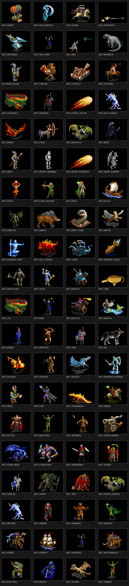

MoMJR Source Art (original Civ2 mod units) — click to expand

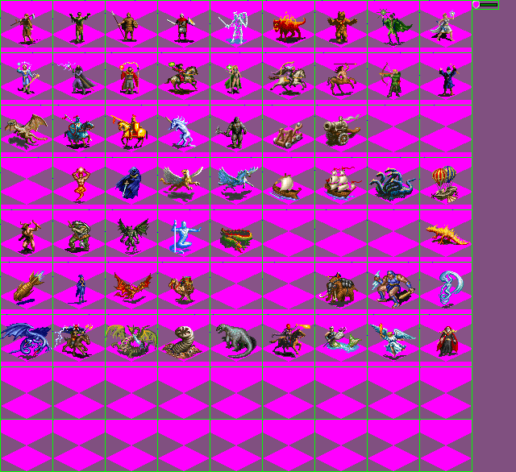

HoMM2 Source Art (alternate candidates) — click to expand

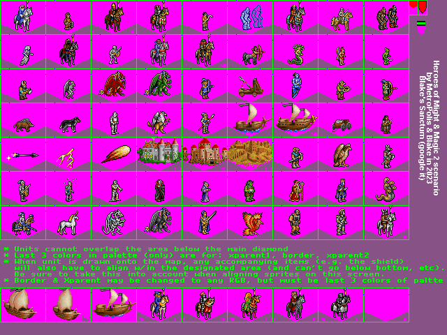

SMM Art Library (182 fantasy units incl. LotR) — click to expand

In-Game Sprite Sheets (what renders on map) — click to expand

## Stat Table

| Icon | Unit | Sphere | Atk | Def | HP | FP | Move | Domain | Cost | Prereq | Source |
|------|------|--------|-----|-----|----|----|------|--------|------|--------|--------|
|  | Archangel | Life | 12 | 12 | 2 | 2 | 4 | Air | 12 | Mag | art 61 / SPRITE_ARCHANGEL |
| 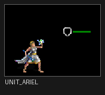 | Ariel | Life | 3 | 8 | 2 | 2 | 2 | Land | 4 | Too | art 8 / SPRITE_ARIEL |
| 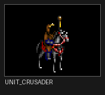 | Crusader | Life | 4 | 4 | 2 | 1 | 1 | Land | 5 | Inv | art 70 / SPRITE_CRUSADER |
| 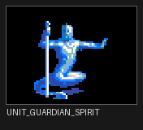 | Guardian Spirit | Life | 1 | 5 | 3 | 1 | 2 | Land | 4 | Inv | art 39 / SPRITE_GUARDIAN_SPIRIT |
| 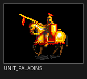 | Paladins | Life | 6 | 2 | 2 | 1 | 2 | Land | 5 | Ldr | art 20 / SPRITE_PALADINS |
| 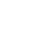 | Pegasus | Life | 5 | 2 | 2 | 2 | 5 | Air | 8 | Las | art 31 / SPRITE_PEGASUS |
|  | Priest | Life | 2 | 3 | 2 | 1 | 1 | Land | 4 | Gen | art 69 / SPRITE_PRIEST |
| 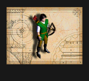 | Serena | Life | 3 | 4 | 2 | 1 | 2 | Land | 6 | Inv | art 12 / SPRITE_SERENA |
|  | Templar | Life | 6 | 5 | 3 | 1 | 1 | Land | 8 | Lab | art 71 / SPRITE_TEMPLAR |
|  | Unicorn | Life | 3 | 6 | 2 | 1 | 3 | Land | 6 | Lab | art 21 / SPRITE_UNICORN |
| 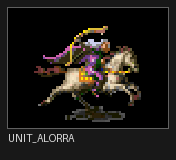 | Alorra | Nature | 6 | 2 | 2 | 1 | 2 | Land | 10 | Rec | art 14 / SPRITE_ALORRA |
| 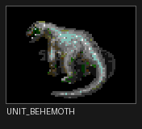 | Behemoth | Nature | 5 | 4 | 4 | 1 | 1 | Land | 9 | Rad | art 58 / SPRITE_BEHEMOTH |
|  | Centaurs | Nature | 2 | 1 | 1 | 1 | 2 | Land | 2 | Env | art 15 / SPRITE_CENTAURS |
| 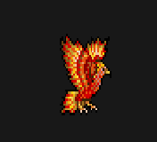 | Cockatrice | Nature | 6 | 1 | 1 | 3 | 2 | Air | 6 | PT | art 40 / SPRITE_COCKATRICE |
| 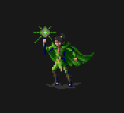 | Druid | Nature | 3 | 3 | 2 | 1 | 1 | Land | 5 | PT | art 73 / SPRITE_DRUID |
| 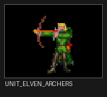 | Elven Archers | Nature | 3 | 1 | 1 | 1 | 1 | Land | 3 | Cor | art 16 / SPRITE_ELVEN_ARCHERS |
|  | Freya | Nature | 4 | 5 | 2 | 2 | 3 | Land | 4 | Plu | art 13 / SPRITE_FREYA |
|  | Great Wyrm | Nature | 15 | 9 | 6 | 2 | 2 | Land | 12 | Ref | art 57 / SPRITE_GREAT_WYRM |
| 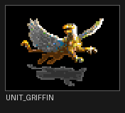 | Griffin | Nature | 4 | 4 | 2 | 1 | 4 | Air | 6 | X4 | art 30 / SPRITE_GRIFFIN |
| 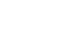 | Merfolk | Nature | 4 | 3 | 2 | 1 | 4 | Sea | 5 | U3 | art 60 / SPRITE_MERFOLK |
| 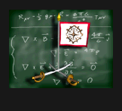 | Treant | Nature | 3 | 8 | 4 | 1 | 1 | Land | 6 | Plu | art 72 / SPRITE_TREANT |
|  | War Mammoth | Nature | 10 | 5 | 3 | 1 | 2 | Land | 8 | Exp | art 51 / SPRITE_WAR_MAMMOTH |
|  | War Troll | Nature | 7 | 5 | 3 | 1 | 1 | Land | 7 | Tac | art 37 / SPRITE_WAR_TROLL |
| 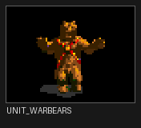 | Warbears | Nature | 3 | 3 | 2 | 1 | 1 | Land | 4 | Plu | art 6 / SPRITE_WARBEARS |
| 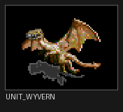 | Wyvern | Nature | 8 | 4 | 2 | 2 | 3 | Air | 12 | Che | art 18 / SPRITE_WYVERN |
| 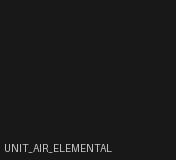 | Air Elemental | Sorcery | 6 | 3 | 1 | 1 | 8 | Air | 5 | X2 | art 53 / SPRITE_AIR_ELEMENTAL |
| 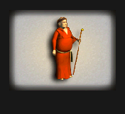 | Apprentice | Sorcery | 2 | 1 | 1 | 1 | 1 | Land | 3 | Hor | art 74 / SPRITE_APPRENTICE |
| 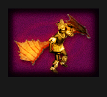 | Crystal Golem | Sorcery | 4 | 6 | 3 | 1 | 1 | Land | 7 | X2 | art 75 / SPRITE_CRYSTAL_GOLEM |
| 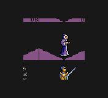 | Djinn | Sorcery | 8 | 5 | 2 | 2 | 3 | Air | 10 | Phy | art 76 / SPRITE_DJINN |
|  | Jafar | Sorcery | 6 | 4 | 2 | 2 | 4 | Land | 6 | The | art 9 / SPRITE_JAFAR |
|  | Mage | Sorcery | 3 | 1 | 1 | 1 | 1 | Land | 4 | X6 | art 17 / SPRITE_MAGE |
| 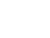 | Phantom Warriors | Sorcery | 3 | 1 | 1 | 2 | 2 | Land | 3 | The | art 4 / SPRITE_PHANTOM_WARRIORS |
| 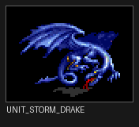 | Storm Drake | Sorcery | 12 | 6 | 3 | 2 | 5 | Air | 14 | Pla | art 54 / SPRITE_STORM_DRAKE |
|  | Storm Giant | Sorcery | 8 | 4 | 2 | 1 | 2 | Land | 9 | NP | art 52 / SPRITE_STORM_GIANT |
| 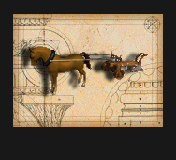 | Warlock | Sorcery | 12 | 2 | 2 | 2 | 2 | Land | 12 | AFl | art 7 / SPRITE_WARLOCK |
|  | Bone Golem | Death | 4 | 7 | 4 | 1 | 1 | Land | 8 | SFl | art 78 / SPRITE_BONE_GOLEM |
| 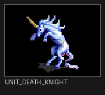 | Death Knight | Death | 8 | 6 | 3 | 1 | 2 | Land | 8 | Mys | art 21 / SPRITE_DEATH_KNIGHT |
|  | Demon | Death | 4 | 5 | 2 | 1 | 2 | Air | 7 | SFl | art 47 / SPRITE_DEMON |
|  | Dracolich | Death | 14 | 7 | 4 | 2 | 3 | Air | 9 | Sth | art 56 / SPRITE_DRACOLICH |
|  | Lich | Death | 6 | 8 | 3 | 2 | 1 | Land | 10 | SE | art 40 / SPRITE_LICH |
|  | Malleus | Death | 8 | 2 | 2 | 1 | 2 | Land | 10 | SE | art 59 / SPRITE_MALLEUS |
|  | Minion | Death | 0 | 0 | 1 | 1 | 2 | Land | 3 | Wri | art 46 / SPRITE_MINION |
|  | Rjak | Death | 6 | 6 | 2 | 2 | 2 | Land | 8 | Rfg | art 10 / SPRITE_RJAK |
|  | Skeletons | Death | 1 | 2 | 1 | 1 | 1 | Land | 3 | Rfg | art 1 / SPRITE_SKELETONS |
| 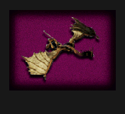 | Undead Dragon | Death | 12 | 6 | 4 | 2 | 3 | Air | 3 | SE | art 56 / SPRITE_UNDEAD_DRAGON |
| 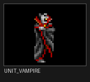 | Vampire | Death | 5 | 4 | 2 | 2 | 2 | Land | 7 | Rob | art 77 / SPRITE_VAMPIRE |
|  | Wraith | Death | 4 | 3 | 2 | 1 | 2 | Land | 6 | Rob | art 29 / SPRITE_WRAITH |
| 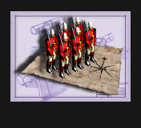 | Zombies | Death | 2 | 2 | 2 | 1 | 1 | Land | 4 | Rfg | art 1 / SPRITE_ZOMBIES |
| 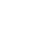 | Drow | Chaos | 4 | 3 | 2 | 2 | 2 | Land | 8 | Min | art 83 / SPRITE_DROW |
|  | Efreet | Chaos | 7 | 3 | 2 | 2 | 1 | Land | 9 | Met | art 28 / SPRITE_EFREET |
| 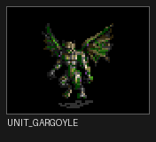 | Gargoyle | Chaos | 2 | 4 | 2 | 1 | 2 | Air | 6 | Med | art 38 / SPRITE_GARGOYLE |
| 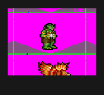 | Goblin | Chaos | 1 | 1 | 1 | 1 | 2 | Land | 2 | MP | art 79 / SPRITE_GOBLIN |
| 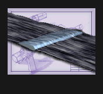 | Hell Hounds | Chaos | 4 | 2 | 1 | 1 | 1 | Land | 6 | MP | art 5 / SPRITE_HELL_HOUNDS |
|  | Hydra | Chaos | 12 | 3 | 3 | 2 | 1 | Land | 12 | Mob | art 34 / SPRITE_HYDRA |
|  | Infernal Device | Chaos | 99 | 0 | 1 | 1 | 10 | Air | 16 | NF | art 45 / SPRITE_INFERNAL_DEVICE |
|  | Minotaur | Chaos | 1 | 2 | 2 | 1 | 1 | Land | 3 | War | art 36 / SPRITE_MINOTAUR |
| 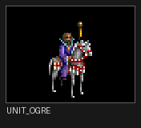 | Ogre | Chaos | 6 | 3 | 3 | 2 | 1 | Land | 7 | Med | art 81 / SPRITE_OGRE |
| 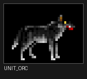 | Orc | Chaos | 3 | 2 | 2 | 1 | 1 | Land | 4 | MP | art 80 / SPRITE_ORC |
|  | Salamander | Chaos | 10 | 3 | 2 | 1 | 2 | Land | 10 | X5 | art 44 / SPRITE_SALAMANDER |
|  | Tauron | Chaos | 8 | 3 | 2 | 3 | 2 | Land | 5 | MP | art 11 / SPRITE_TAURON |
| 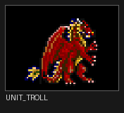 | Troll | Chaos | 5 | 4 | 3 | 1 | 1 | Land | 6 | Met | art 82 / SPRITE_TROLL |
|  | Warrax | Chaos | 8 | 3 | 2 | 2 | 2 | Land | 12 | Min | art 55 / SPRITE_WARRAX |
|  | Airship | Neutral | 5 | 1 | 1 | 1 | 6 | Air | 4 | X3 | art 35 / SPRITE_AIRSHIP |
|  | Arch Mage | Neutral | 6 | 3 | 2 | 2 | 1 | Land | 10 | Fli | art 65 / SPRITE_ARCH_MAGE |
| 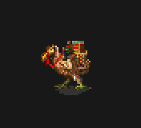 | Caravan | Neutral | 0 | 1 | 1 | 1 | 1 | Land | 5 | Tra | art 48 / SPRITE_CARAVAN |
|  | Catapult | Neutral | 6 | 1 | 1 | 1 | 1 | Land | 4 | Mat | art 23 / SPRITE_CATAPULT |
| 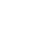 | Dwarf Crossbow | Neutral | 3 | 3 | 2 | 2 | 1 | Land | 5 | Mas | art 67 / SPRITE_DWARF_CROSSBOW |
| 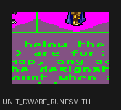 | Dwarf Runesmith | Neutral | 5 | 6 | 3 | 1 | 1 | Land | 9 | Esp | art 68 / SPRITE_DWARF_RUNESMITH |
| 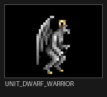 | Dwarf Warrior | Neutral | 4 | 5 | 3 | 1 | 1 | Land | 6 | Iro | art 66 / SPRITE_DWARF_WARRIOR |
|  | Galley | Neutral | 1 | 1 | 1 | 1 | 3 | Sea | 4 | Map | art 32 / SPRITE_GALLEY |
| 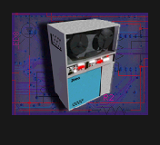 | Iron Golem | Neutral | 8 | 5 | 4 | 1 | 1 | Land | 9 | Esp | art 22 / SPRITE_IRON_GOLEM |
|  | Knights | Neutral | 4 | 2 | 1 | 1 | 2 | Land | 4 | Chi | art 19 / SPRITE_KNIGHTS |
|  | Lamp | Neutral | 0 | 1 | 1 | 1 | 0 | Land | 0 | nil | art 63 / SPRITE_LAMP |
| 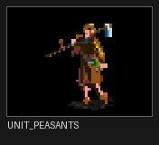 | Peasants | Neutral | 0 | 1 | 2 | 1 | 1 | Land | 4 | nil | art 0 / SPRITE_PEASANTS |
|  | Settler | Neutral | 0 | 2 | 2 | 1 | 1 | Land | 7 | nil | art 62 / SPRITE_SETTLER |
|  | Spearmen | Neutral | 1 | 1 | 1 | 1 | 1 | Land | 1 | nil | art 2 / SPRITE_SPEARMEN |
|  | Steam Cannon | Neutral | 10 | 2 | 2 | 2 | 1 | Land | 12 | X3 | art 24 / SPRITE_STEAM_CANNON |
| 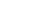 | Swordsmen | Neutral | 2 | 2 | 1 | 1 | 1 | Land | 2 | Bro | art 3 / SPRITE_SWORDSMEN |
| 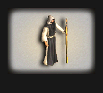 | War Mage | Neutral | 4 | 2 | 1 | 1 | 1 | Land | 6 | E1 | art 64 / SPRITE_WAR_MAGE |
|  | Warship | Neutral | 7 | 3 | 2 | 1 | 4 | Sea | 8 | Eng | art 33 / SPRITE_WARSHIP |

**Total: 80 units** (80 with icons)
